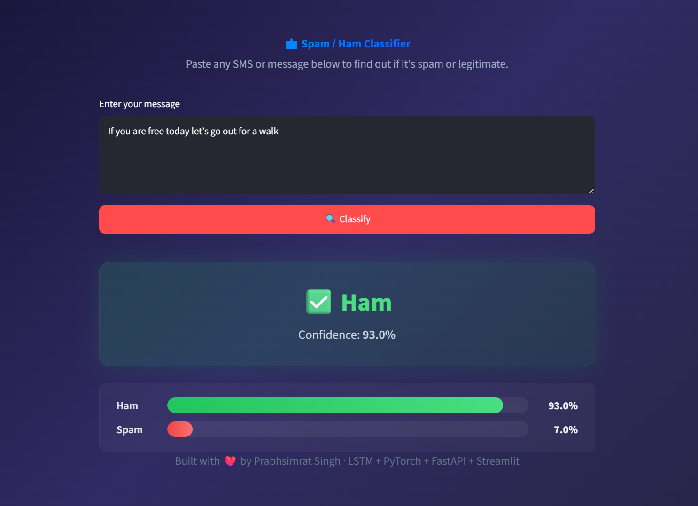
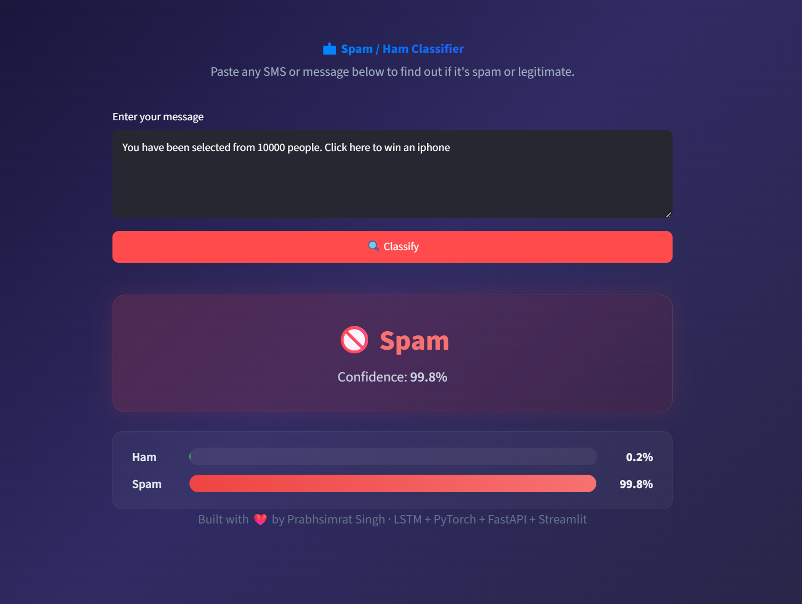

# Spam Ham Classifier

A spam classifier built from scratch using PyTorch, focused on using **simple and easy-to-understand approaches** to solve three real problems — capturing semantic meaning in text, handling variable-length sequences efficiently, and dealing with class imbalance. Instead of relying on black-box pre-trained models like Gensim's Word2Vec or traditional ML models that ignore word order entirely, everything here is built from the ground up so you can see exactly what's happening and why.

**Live Demo**: [spam-ham-frontend.streamlit.app](https://spam-ham-frontend.streamlit.app/)

**Docker Image**:
```bash
docker pull prabhsimrat/spam-ham:latest
```

### Results

| Ham Detection | Spam Detection |
|:---:|:---:|
|  |  |

---

## What makes this different from traditional approaches

Most spam classifiers you'll find online use **Bag of Words** or **TF-IDF** + a traditional ML model like Naive Bayes or Logistic Regression. These approaches treat text as a flat collection of words — they don't care about the order. So "Free call now" and "Now call free" look the same to them.

This project takes a different route with three key ideas:

**1. Capturing semantic meaning with LSTM** — Instead of treating words as isolated features, an LSTM reads the message word by word, maintains a memory of what it has seen so far, and uses that context to make a decision. Patterns like "click here to win" or "call now to claim" are captured as sequences, not just scattered keywords. This is something Bag of Words or TF-IDF simply cannot do.

**2. Training our own embeddings instead of using pre-trained ones** — Pre-trained models like Gensim's Word2Vec are powerful, but they're also black boxes trained on massive general-purpose corpora. You don't really know what relationships they've learned. Here, embeddings are created from scratch using `nn.Embedding` and trained specifically on this dataset for this task. Every word vector is learned in the context of spam vs ham classification — nothing more, nothing less. You can see exactly what's being learned.

**3. Handling class imbalance with intuitive weight assignment** — With ~87% ham and ~13% spam, the model would naturally lean towards predicting ham. The fix is a simple formula: `total / (2 * class_count)`. This gives spam a weight of ~3.73 and ham ~0.58, meaning every spam misclassification costs the model ~6.5x more. No complex oversampling or synthetic data generation — just a straightforward penalty that works.

On top of these, the custom **collate function** dynamically pads sequences to the max length within each batch rather than using a fixed global max. A batch of short messages gets padded to 12 tokens, not 189. Simple idea, less wasted computation.

---

## Tech Stack

| Layer | Tool |
|-------|------|
| Model | PyTorch (LSTM + custom Embeddings) |
| Preprocessing | NLTK (tokenisation), Python string module |
| API | FastAPI + Uvicorn |
| Validation | Pydantic |
| Containerisation | Docker |
| Deployment (API) | AWS EC2 |
| Frontend | Streamlit (hosted on Streamlit Cloud) |

---

## How it works — end to end

### 1. The Dataset

The dataset used is the classic **SMS Spam Collection** — 5,572 messages labelled as either `ham` (legitimate) or `spam`.

```
ham     4825 messages (86.6%)
spam     747 messages (13.4%)
```

There's a clear class imbalance here. Spam makes up only ~13% of the data. If the model just predicted "ham" for everything, it would still be ~87% accurate. This is handled later using class weights.

---

### 2. Text Cleaning

Three simple preprocessing steps are applied to every message:

**Lowercase** — Everything is converted to lowercase so "FREE" and "free" are treated the same.

**Remove Punctuation** — All punctuation is stripped using Python's `string.punctuation` and `str.maketrans()`. This keeps the vocabulary clean and avoids treating "call" and "call!" as different words.

**Tokenisation** — Each cleaned message is split into individual words using NLTK's `word_tokenize`. So `"hey are you coming tonight"` becomes `["hey", "are", "you", "coming", "tonight"]`.

---

### 3. Train-Test Split

The dataset is split into **80% training** and **20% testing** using PyTorch's `random_split`. This gives us 4,457 messages to train on and 1,115 to test with.

---

### 4. Building the Vocabulary (on training data only)

A vocabulary dictionary is built from the **training data only** — this is important. If the vocab included test data, the model would have unfair knowledge of words it shouldn't have seen yet.

The vocab starts with two special tokens:
- `<PAD>: 0` — used later for padding shorter sentences
- `<UNK>: 1` — used for words the model hasn't seen during training

Then every unique word in the training set is assigned a unique integer. The final vocab size comes out to **8,531 words**.

Each message is then converted from a list of words to a list of integers using this mapping. Any word not found in the vocab (during test or inference) gets mapped to `<UNK>`.

---

### 5. Custom Embeddings (100 dimensions)

Instead of loading pre-trained vectors from Word2Vec or GloVe, the model creates its own embeddings using `nn.Embedding(8531, 100)`.

This means each of the 8,531 words in the vocab gets a **100-dimensional vector** that is randomly initialised and then **learned during training**. The advantage is that these embeddings are optimised specifically for the spam/ham task — not for general-purpose language understanding.

---

### 6. The Core PyTorch Components

#### The Model (`mymodel`)

```python
class mymodel(nn.Module):
    def __init__(self):
        super().__init__()
        self.embedding = nn.Embedding(VOCAB_SIZE, 100)
        self.lstm = nn.LSTM(input_size=100, hidden_size=128, batch_first=True)
        self.dropout = nn.Dropout(0.5)
        self.fc1 = nn.Linear(128, 2)
```

The architecture:
1. **Embedding Layer** — Converts word indices into 100-dimensional dense vectors
2. **LSTM Layer** — Processes the sequence of embeddings, producing a 128-dimensional hidden state that captures the context of the entire message
3. **Dropout (0.5)** — Applied on the final hidden state to prevent overfitting
4. **Fully Connected Layer** — Maps the 128-dim hidden state to 2 output classes (Ham, Spam)

The key thing in the `forward` pass — only the **last hidden state** (`h_n[-1]`) is used. This is the LSTM's summary of the entire message after reading it word by word.

---

#### The Dataset Class (`mydataset`)

```python
class mydataset(Dataset):
    def __init__(self, x, y):
        self.x = x
        self.y = y
        self.n_samples = len(self.x)

    def __getitem__(self, index):
        return self.x.iloc[index], self.y.iloc[index]
```

A straightforward PyTorch Dataset that wraps the pandas Series. The DataLoader uses this to feed batches of (encoded_message, label) pairs into training.

---

#### The Collate Function

This is one of the more interesting parts. Normally, you'd pick a fixed max length (say 50 or 100) and pad/truncate every message to that length. That's wasteful — a batch of short messages still gets padded to the global max.

The custom collate function takes a **per-batch** approach:

```python
def collate(batch):
    maxi = 0
    x, y = [], []
    for sentence, labels in batch:
        maxi = max(maxi, len(sentence))
        x.append(sentence)
        y.append(labels)

    for i in range(len(x)):
        x[i] = x[i] + [0] * (maxi - len(x[i]))

    return torch.tensor(x, dtype=torch.long), torch.tensor(y, dtype=torch.long)
```

It finds the longest message **in that specific batch** and pads everything else to match. So if the longest message in a batch has 12 words, everything is padded to 12 — not to some global max of 189. This is more efficient and reduces unnecessary computation.

---

#### Handling Class Imbalance with Weights

With 4,825 ham and 747 spam messages, the model would naturally lean towards predicting ham. The fix is simple and intuitive — assign higher weight to the minority class so that every spam misclassification is penalised more:

```python
weight_ham  = total / (2 * ham_count)    # ≈ 0.577
weight_spam = total / (2 * spam_count)   # ≈ 3.728
```

These weights are passed to `CrossEntropyLoss`. This means misclassifying a spam message costs the model ~6.5x more than misclassifying a ham message. The formula `total / (2 * class_count)` is a standard approach — a perfectly balanced dataset would give both classes a weight of 1.0.

---

### 7. Training

- **Optimiser**: Adam with learning rate 0.001
- **Loss Function**: CrossEntropyLoss with class weights
- **Epochs**: 75
- **Batch Size**: 32

The loss drops steadily from ~96.7 in epoch 0 down to ~0.0004 by epoch 74, with a few spikes along the way (epoch 16 jumped to 4.33) that the model recovers from.

---

### 8. Testing

The model achieves **97.67% accuracy** on the test set.

Manual testing with tricky edge cases shows it handles most scenarios well:

```
True: spam | Predicted: spam | Congratulations you have won a free prize worth 1000 dollars
True: spam | Predicted: spam | URGENT your account has been selected for a cash reward
True: ham  | Predicted: ham  | Hey are you coming to the party tonight
True: ham  | Predicted: ham  | Can you pick up some milk on the way home
True: ham  | Predicted: ham  | Free workshop on machine learning this saturday
```

---

### 9. API Layer (FastAPI)

The trained model is wrapped with FastAPI to serve predictions as a REST API.

**Input validation** is handled using a Pydantic model that enforces:
- Non-empty string (min 1 character)
- Max 500 characters
- Whitespace-only strings are rejected

```python
class SMStext(BaseModel):
    text: str = Field(..., min_length=1, max_length=500)

    @field_validator("text")
    @classmethod
    def strip_and_validate(cls, v: str) -> str:
        v = v.strip()
        if not v:
            raise ValueError("Text must not be empty or whitespace-only")
        return v
```

The `/predict` endpoint takes this validated input, runs it through the same preprocessing pipeline (lowercase, remove punctuation, tokenise, encode), feeds it through the model, and returns the prediction with confidence scores:

```json
{
  "predicted_result": "Spam",
  "confidence": 0.9847,
  "class_probabilities": {
    "Ham": 0.0153,
    "Spam": 0.9847
  }
}
```

---

### 10. Deployment

- **API**: Dockerised with `python:3.12-slim` and CPU-only PyTorch (image size ~1.7GB instead of 8.5GB with CUDA). Hosted on AWS EC2.
- **Frontend**: Streamlit app hosted on Streamlit Cloud, talks to the EC2 API.

---

## Project Structure

```
Spam-Ham-Predictor/
├── app.py                  # FastAPI endpoints
├── inference.py            # Model loading and prediction logic
├── model.py                # LSTM model definition
├── preprocess.py           # Text cleaning pipeline
├── frontend.py             # Streamlit UI
├── test.py                 # Quick test script
├── Dockerfile              # Container config for API
├── requirements.txt        # API dependencies
├── .dockerignore
├── .gitignore
├── schema/
│   ├── user_input.py       # Pydantic input validation (SMStext)
│   └── prediction_response.py  # Pydantic response model
├── models/
│   ├── spam_classifier.pth # Trained model weights
│   └── vocab.pkl           # Vocabulary dictionary
└── notebooks/
    └── Untitled.ipynb      # Training notebook
```

---

## Limitations

This model works well for the dataset it was trained on, but there are clear limitations to be aware of:

- **Small training data** — The model was trained on just ~4,500 messages. That's enough to learn common spam patterns, but not enough to generalise to every possible variation of spam out there.

- **LSTMs are data hungry** — LSTMs learn sequential patterns, and they need a lot of data to learn them well. With a small dataset, the model has limited exposure to diverse sentence structures and phrasing styles.

- **Real-world text is more complex** — Real messages can have sarcasm, slang, code-switching between languages, URLs, emojis, and context that spans multiple messages. A simple single-layer LSTM trained on 5,572 SMS messages is not going to handle all of that. For production-grade spam filtering, you'd need a much larger dataset and likely a more powerful architecture (transformers, for example).

The goal here was never to build the best spam filter — it was to demonstrate these core NLP and deep learning concepts using simple, understandable approaches.

---

## Run Locally

**Start the API**
```bash
pip install -r requirements.txt
uvicorn app:app --reload
```

**Start the frontend**
```bash
pip install streamlit requests
streamlit run frontend.py
```

API docs available at `http://localhost:8000/docs`

---

Made by **Prabhsimrat Singh**
